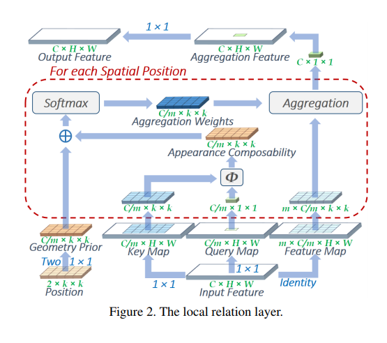

## Local Relational Networks for Image Recognition
A Pytorch implementation of the local relational layer from Local Relational Networks for Image Recogntion [[paper](https://arxiv.org/pdf/1904.11491.pdf)]. The notebook is there so you can try it out on [[Colab](https://colab.research.google.com/github/gan3sh500/local-relational-nets/blob/master/lrnet.ipynb)].



## Dependancies
```
pip install <pytorch-latest.whl url>
```

To use the layer:
```
from layer import LocalRelationalLayer
```
